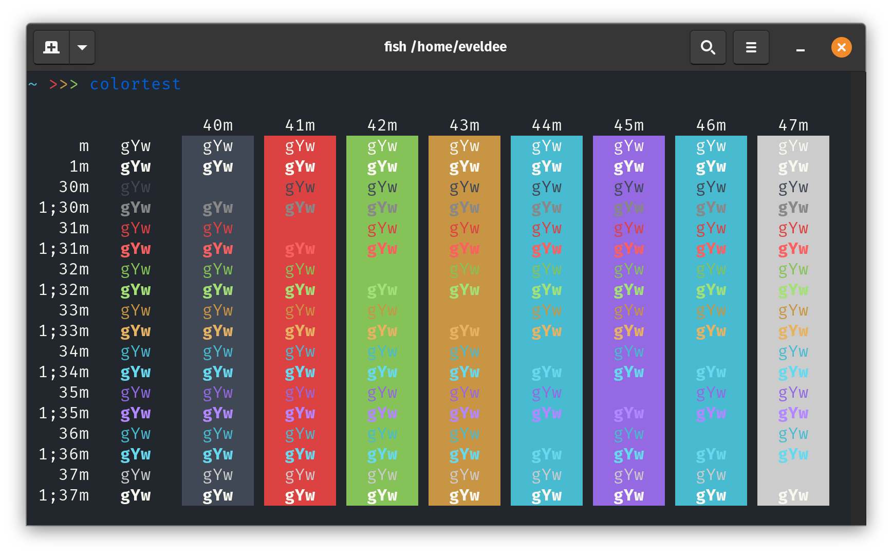

# Gnome Terminal



## Download

### Using Git

If you are a git user, you can install the theme by cloning the repo:

```
git clone https://github.com/Eveldee/Monokai-Flat.git
```

### Manually

Download using the [GitHub .zip download](https://github.com/Eveldee/Monokai-Flat/archive/refs/heads/master.zip) option and unzip them.

## Activate theme

1. You will need the `dconf` command:

```bash 
$ sudo apt-get install dconf-cli 
```

2. Then you can run the installation script:

```bash
$ cd gnome-terminal
$ ./install.sh
```

For more info, visit [
gnome-terminal-colors-solarized ](https://github.com/aruhier/gnome-terminal-colors-solarized) repository where this script is taken from.