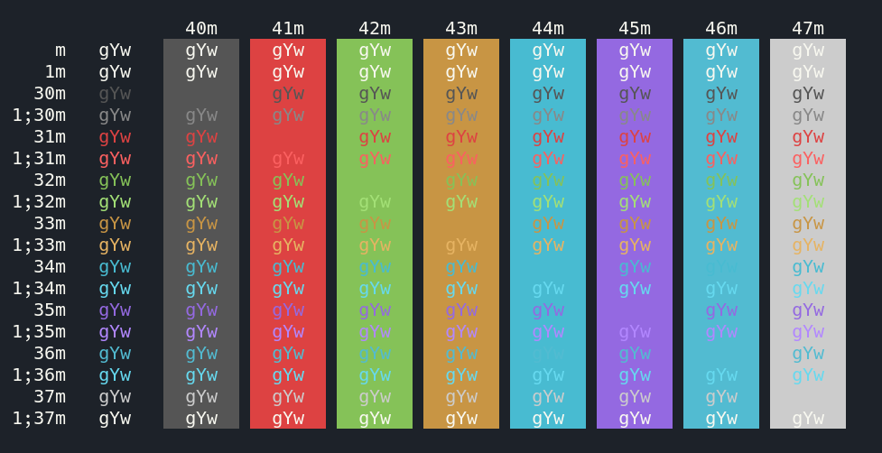
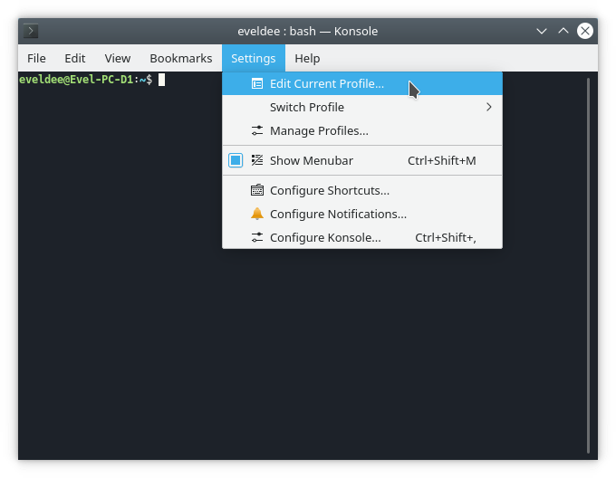
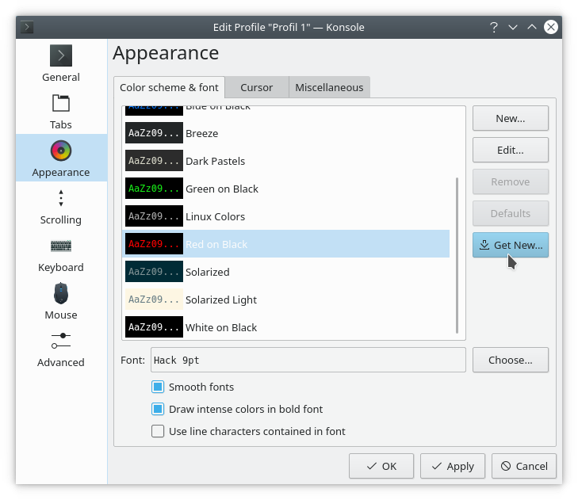
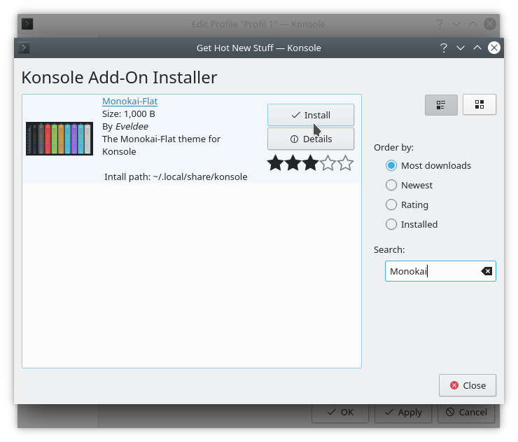

# Konsole

> View on [KDE Store](https://store.kde.org/p/1244183/)

## Installation

Open Konsole -> Settings -> Edit current profile

> Settings

Then go to appearance, click on ***Get New*** button

> Appearance dialog

Then **install** the theme

> Install theme dialog

Now just **select** it in the theme list and it **works** !

## Colors

| Name             |  Color  | Intense Color | Faint Color |
| ---------------- | :-----: | :-----------: | :---------: |
| Foreground       | #F8F8F0 |    #F8F8F0    |   #F8F8F0   |
| Background       | #1D2229 |    #1D2229    |   #1D2229   |
| Color 1 (Dark)   | #1D2229 |    #888888    |   #1D2229   |
| Color 2 (Red)    | #DD4242 |    #FB6060    |   #DD4242   |
| Color 3 (Green)  | #85C258 |    #A3E076    |   #85C258   |
| Color 4 (Yellow) | #C89544 |    #E6B362    |   #C89544   |
| Color 5 (Blue)   | #48BBD1 |    #66D9EF    |   #48BBD1   |
| Color 6 (Purple) | #9469E1 |    #B287FF    |   #9469E1   |
| Color 7 (Cyan)   | #48BBD1 |    #66D9EF    |   #48BBD1   |
| Color 8 (White)  | #CCCCCC |    #F8F8F0    |   #CCCCCC   |

> Color palette