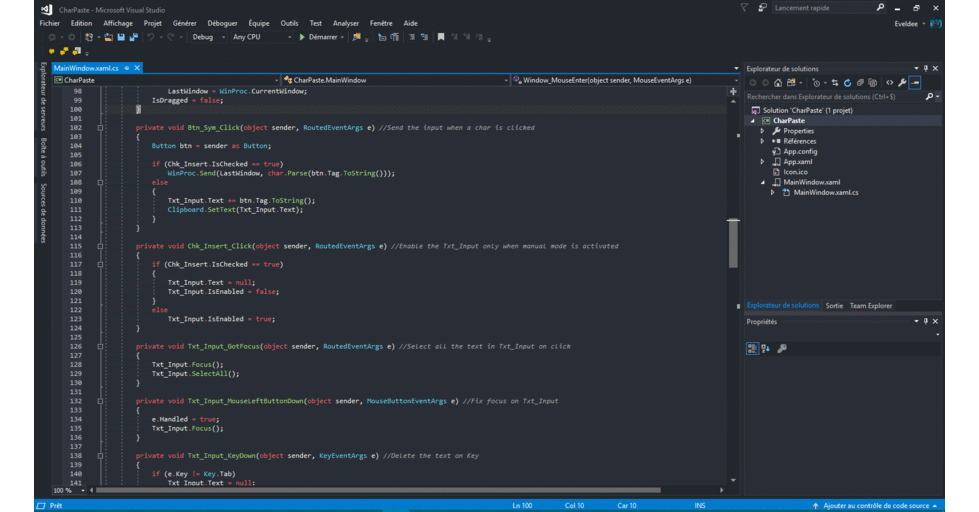
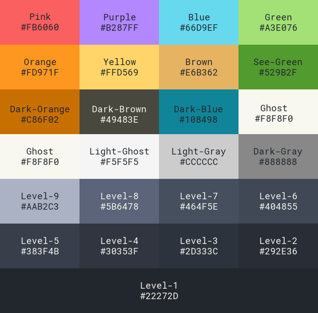

# Monokai-Flat

A material monokai color scheme for Visual Studio, Visual Studio Code, JetBrains IDE and some terminal

## Colors

Material-Flat use the following colors:  
  
>The full palette can be imported in [Gimp](https://www.gimp.org/) or [Gpick](http://www.gpick.org/).  
See [palette.gpa](Color/palette.gpa) and [palette.gpl](Colors/palette.gpl)

You can see color codes [here](Colors/Palette.md).

## Install instructions

- [Visual Studio](Visual%20Studio)
- [Visual Studio Code](Visual%20Studio%20Code)
- [JetBrains IDE](JetBrains%20IDE)
- [Konsole](Konsole)
- [Windows Terminal](Windows%20Terminal)
- [Windows CMD](Windows%20Terminal%20-%20CMD)

## Copyright and license

This theme can be used freely in every projects, commercial or not as it is
licensed under the [Creative Commons Zero v1.0 Universal](LICENSE) license.
