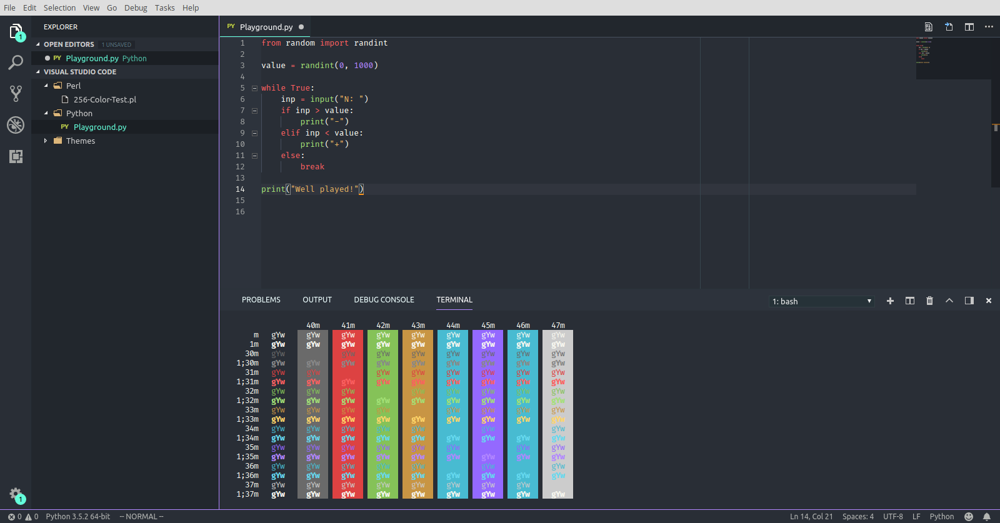

# Visual Studio Code



**Monokai-Flat** theme for **VSCode** based on [Material Theme][Material Theme], currently tested for C#, Java, Python, HTML, CSS, XML, JSON, YAML, Markdown which Markdown, CSS, YAML need update


## Installation

1. Install [Material Theme][Material Theme] extension
2. Select `Material Theme` theme _(Command Palette > Preferences: Color Theme > Material Theme)_
3. Open settings json file _(Command Palette > Preferences: Open Settings (JSON))_
4. Copy and paste the content of [Monokai-Flat.jsonc](https://raw.githubusercontent.com/Eveldee/Monokai-Flat/master/Visual%20Studio%20Code/Monokai-Flat.jsonc) without the first `{}` scope
5. You can now [customise](#customization) the theme colors as you please

## Customization

You can change each color by changing the appropriate property in the JSON config. Workbench colors are after `// Workbench Theme` and language specific syntax after `// Syntax Theme`.

All properties are grouped so you can easily select what you want to modify and do a `Replace` on one color.

You can find all used colors in the [main README](../README.md) and in the [color palette](../Colors/Palette.md).

### Cursor color

Cursor color _(orange)_ is defined by the property `"editorCursor.foreground": "#FD971F"` in `// Editor Colors`

### Separation/Border colors

You can change the purple separation color using the following properties:

```json
"activityBar.border": "#B287FF",
...
"sideBar.border": "#B287FF",
...
"editorGroup.border": "#B287FF",
...
"panel.border": "#B287FF",
"panelTitle.activeBorder": "#B287FF",
...

"statusBar.border": "#B287FF",
"statusBarItem.prominentBackground": "#B287FFDD",
...

```

## Notes on accent color

Changing accent color using Material Theme command override this theme settings _(you can recover from it easily by doing an `Undo` in the settings file)_.

To change accent color, find `// Accent color` in the settings, select all accent color properties and do a `Replace`.

## Community Material Theme

This theme has not been tested on [Community Material Theme][Community Material Theme] but it should work by just changing

```json
// Workbench Theme
"workbench.colorCustomizations": {
    "[Material Theme]": {
```

To

```json
// Workbench Theme
"workbench.colorCustomizations": {
    "[Community Material Theme]": {
```

<!-- Links -->
[Material Theme]: https://marketplace.visualstudio.com/items?itemName=Equinusocio.vsc-material-theme
[Community Material Theme]: https://marketplace.visualstudio.com/items?itemName=equinusocio.vsc-community-material-theme