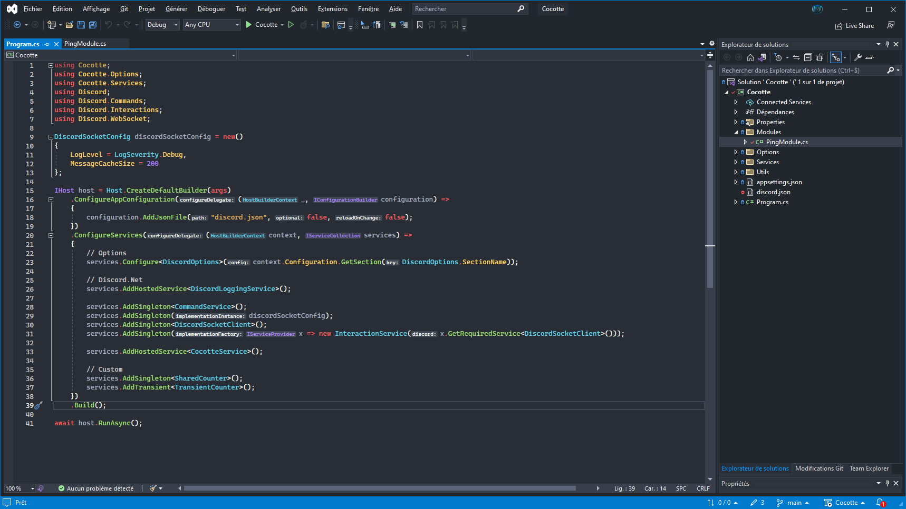

# Visual Studio

**Monokai-Flat** theme for **Visual Studio**, available on [Visual Studio Marketplace](https://marketplace.visualstudio.com/items?itemName=Eveldee.Monokai-Flat) for **Visual Studio 2022 or newer**

## Installation

- Download the extension from [Visual Studio Marketplace](https://marketplace.visualstudio.com/items?itemName=Eveldee.Monokai-Flat)
- Open the downloaded .vsix file to install
- Open Visual Studio and select Monokai-Flat in `Tools > Theme`

## Old Visual Studio version

An **old version** of the theme can be found in the [_Old folder](https://github.com/Eveldee/Monokai-Flat/tree/master/Visual%20Studio/_Old), this can be installed using the [Color Theme Editor extension](https://marketplace.visualstudio.com/items?itemName=VisualStudioPlatformTeam.VisualStudio2019ColorThemeEditor) for your **corresponding VS version**.

## Modify and build the theme

- Install [Color Theme Designer](https://marketplace.visualstudio.com/items?itemName=ms-madsk.ColorThemeDesigner) extension
- Clone this repository
- Open `Visual Studio/Theme/Monokai-Flat.sln` in Visual Studio
- Modify `CustomTheme.vstheme`
- Apply or build the solution and install the generated .vsix file