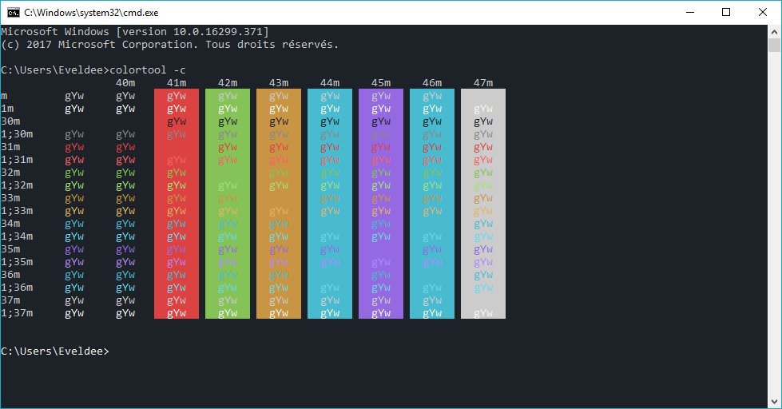

# Windows Terminal - CMD

## Installation

For this, you will need to use Colortool, available [Here][GitHub]

- Download latest version from [Releases][Releases], extract it
- Copy [Monokai-Flat.ini][File] to the `schemes` folder
- Run in a cmd: `ColorTool.exe -b Monokai-Flat.ini`

To uninstall, just change the theme to `campbell.ini` or `cmd-legacy.ini` using
theme same command

## Colors

| Name           |    Color    |
| -------------- | :---------: |
| DARK_BLACK     |  29,34,41   |
| DARK_BLACK     |  29,34,41   |
| DARK_BLUE      | 72,187,209  |
| DARK_GREEN     | 133,194,88  |
| DARK_CYAN      | 72,187,209  |
| DARK_RED       |  221,66,66  |
| DARK_MAGENTA   | 148,105,225 |
| DARK_YELLOW    | 200,149,68  |
| DARK_WHITE     | 204,204,204 |
| BRIGHT_BLACK   | 136,136,136 |
| BRIGHT_BLUE    | 102,217,239 |
| BRIGHT_GREEN   | 163,224,118 |
| BRIGHT_CYAN    | 102,217,239 |
| BRIGHT_RED     |  251,96,96  |
| BRIGHT_MAGENTA | 178,135,255 |
| BRIGHT_YELLOW  | 230,179,98  |
| BRIGHT_WHITE   | 248,248,240 |

> Color palette

[File]: Monokai-Flat.ini
[GitHub]: https://github.com/microsoft/terminal/tree/master/src/tools/ColorTool
[Releases]: https://github.com/microsoft/terminal/tree/master/src/tools/ColorTool
