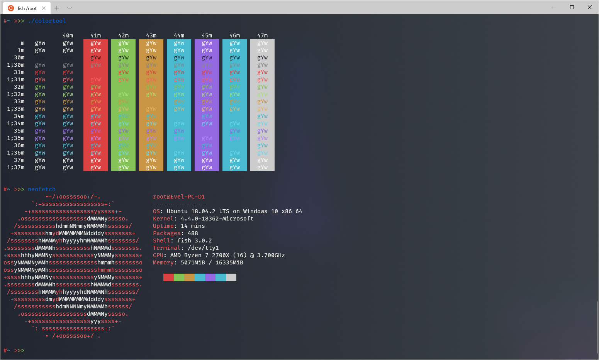

# Windows Terminal



> You can get Windows Terminal
> [here](https://www.microsoft.com/en-us/p/windows-terminal-preview/)

## Installation

Go to the settings and find `schemes`, add it the theme so you should have:

```json
"schemes":
    [
        {
            "name": "Monokai-Flat",
            "foreground": "#F8F8F0",
            "background": "#1D2229",
            "selectionBackground": "#B0BBCC",
            "black": "#1D2229",
            "white": "#CCCCCC",
            "blue": "#48BBD1",
            "cyan": "#48BBD1",
            "green": "#85C258",
            "purple": "#9469E1",
            "red": "#DD4242",
            "yellow": "#C89544",
            "brightBlack": "#888888",
            "brightWhite": "#F8F8F0",
            "brightBlue": "#66D9EF",
            "brightCyan": "#66D9EF",
            "brightGreen": "#A3E076",
            "brightPurple": "#B287FF",
            "brightRed": "#FB6060",
            "brightYellow": "#E6B362"
        }
    ],
```

Now configure a profile to use a theme in `profiles`, like this:

```json
"profiles":
    [
        {
            "guid": "{2c4de342-38b7-51cf-b940-2309a097f518}",
            "hidden": false,
            "name": "Ubuntu",
            "source": "Windows.Terminal.Wsl",
            ...
            ...
            "colorScheme": "Monokai-Flat" <--
        },
    ]
```

You should now see the theme as changes are applied when you save the file!

## Colors

| Name                |  Color  |
| ------------------- | :-----: |
| foreground          | #F8F8F0 |
| background          | #1D2229 |
| selectionBackground | #B0BBCC |
| black               | #1D2229 |
| white               | #CCCCCC |
| blue                | #48BBD1 |
| cyan                | #48BBD1 |
| green               | #85C258 |
| purple              | #9469E1 |
| red                 | #DD4242 |
| yellow              | #C89544 |
| brightBlack         | #888888 |
| brightWhite         | #F8F8F0 |
| brightBlue          | #66D9EF |
| brightCyan          | #66D9EF |
| brightGreen         | #A3E076 |
| brightPurple        | #B287FF |
| brightRed           | #FB6060 |
| brightYellow        | #E6B362 |

> Color palette
